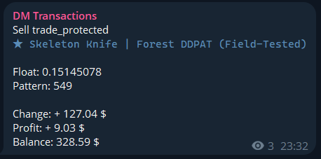
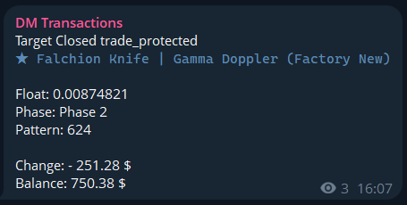

# DMarket-To-Telegram Transactions Poster

A Go application to post DMarket transactions such as Sales, Purchases and Closed Targets to Telegram.

## Setup

Requires **Go 1.16+** (tested on Go 1.24.5, Windows 10).

1. Clone the repo: `git clone https://github.com/cyberbebebe/dmarket-transactions-poster.git`
2. `cd dmarket-transactions-poster`
3. Copy and fill config templates:

   PRIVATE KEYs:
   `copy config\secretKeys.example.json config\secretKeys.json` (Windows)
   or `cp config/secretKeys.example.json config/secretKeys.json` (Unix/Mac)

   fill with your DMarket PRIVATE API key(s) (use array even if 1 account) and Telegram bot token(s) (from [@BotFather](https://t.me/BotFather) in Telegram).

   PUBLIC KEYs -> Telegram chat IDs:

   `copy config\chatids.example.json config\chatids.json` (Windows)
   or `cp config/chatids.example.json config/chatids.json` (Unix/Mac)

   fill with your DMarket PUBLIC API key(s) and corresponding Telegram chat ID(s).
   To get a chat ID: Open [web.telegram.org](https://web.telegram.org), go to your channel, and check the URL. If it ends in `#-721752185`, your chatID is `-100721752185`:
   `{"public key here": {"transactions": "-100721752185"}}` in `chatids.json`.

4. Install dependencies: `go mod tidy`
5. Run the app:
   - `go run cmd/transactionTracker/main.go`
     or build an .exe file:
   - `go build -o DMTransactions.exe ./cmd/transactionTracker`

**Troubleshooting**: If configs fail to load, check JSON format. Set `GOPATH` if not default. For multi-account, ensure arrays in JSON match (e.g., private keys index to public keys).

## Structure

- `cmd/transactionTracker/`: Main executable entrypoint.
- `services/`: Shared Go modules (e.g., headers builder, transactions, timestamps by keys).
- `config/`: Your keys and templates (real files ignored by Git via `.gitignore`).

## Dependencies

- Go 1.16+
- [Telegram Bot API](https://github.com/go-telegram-bot-api/telegram-bot-api) v5.5.1

## Examples

Sold with trade-protected status post example:

(balance note below)

Target Closed with trade-protected status post example:

Reverted Sell post example (from older code version):

(For multi-account setup, the programm cycles through keys)

## Important notes before use:

1. This is **half-vibecoded project** by Go beginner amateur **for self usage**. 
This code is **not** what professional project should be like.
2. There are some inconveniences, "rules" and limitations due to DMarket's web history and dumb "programmer":
   2.1) This code uses history endpoint with sorting **by updatedAt**, this means that transactions that where trade protected **will post again** with new status "Success" or "Reverted".
   2.1.1) "Double-posting" can be "prevented" by adding `&sortBy=createdAt` http param to endpoint in func GetLastTransactions(), **however** using this will **not** let you know if a transaction got "Reverted" or moved from pending to "Success".
   2.2) Balance amount **is approximation** if transaction type is "Sell" or "Target Closed" due to DMarket's balance field calculated as `usable balance + lot sold price`, **not income**, so i cut out 2% fee. **However** for items cheaper than ~7$ sale fee is 10%. This code do **not** check each item's price and fees. *It could be fixed by requesting balance endpoint everytime, but i'm too lazy for this.*
   Also, i do **not** track "Instant sale" and "Trade" actions because i don't use them. Adding this **requires** more code changes than just adding parameters to link.
   2.3) Profit line **will not** appear every time due to **itemId**s are **not** available in some new and all transactions made roughly **before** September 2025.
   *Maybe i will "expand" "bought-list" using /user-targets/closed endpoint in future*.
   2.4) History **does not** respond with offset greater than **100.000**. I dont have this many transactions, so i probably won't bother fixint it for a few years.
   2.5) This code requests up to 10 last updated transactions per 15 seconds (by default). However this can be modified by increasing the limit from `&limit=10` to `&limit=100` in func GetLastTransactions() endpoint or/and changing the timing  in main.go: `time.Sleep(15 * time.Second)` for something like `time.Sleep(5 * time.Minute)`
   **Warning:** telegram **will** mute your bot/channel up to 1 minute if you spam too much messages in a few seconds (like 30 messages per 2 seconds).
   2.6) This code use **1 telegram bot** for posting across all channels. It can be changed but this need some major changes in secretKeys.json and some services/ files so i do not recommend changing it unless you have patience to read and modify this not-very-well-written code. 
   2.6) There is probably more features to be added and bugs to be found.
