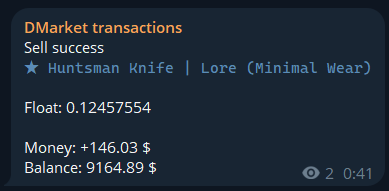
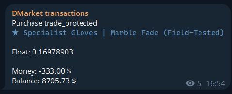
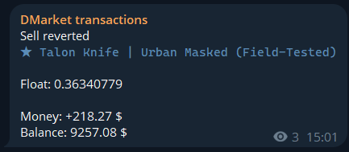

# DMarket-To-Telegram Transactions Poster

A Go application to track DMarket transactions such as Sales, Purchases and Closed Targets and post them to Telegram via bot.

## Setup

Requires **Go 1.16+** (tested on Go 1.24.5, Windows 10).

1. Clone the repo: `git clone https://github.com/cyberbebebe/dmarket-transactions-poster.git`
2. `cd dmarket-transactions-poster`
3. Copy and fill config templates:

   PRIVATE KEYs:
   `copy config\secretKeys.example.json config\secretKeys.json` (Windows)

   or `cp config/secretKeys.example.json config/secretKeys.json` (Unix/Mac)

   fill with your DMarket PRIVATE API key(s) (use array even if 1 account tracking) and Telegram bot token(s) (get from [@BotFather](https://t.me/BotFather) in Telegram).

   PUBLIC KEYs -> Telegram chat IDs:

   `copy config\chatids.example.json config\chatids.json` (Windows)

   or `cp config/chatids.example.json config/chatids.json` (Unix/Mac)

   fill with your DMarket PUBLIC API key(s) (if needed - multiple) and corresponding Telegram chat ID (IDs if multiple).
   To get a chat ID (channel ID): Visit [web.telegram.org](https://web.telegram.org), open your created channel, check the address bar—the URL ends with something like `#-721752185`. For posting, prefix it with `-100` (e.g., `"transactions": "-100721752185"` in `chatids.json`).

4. Install dependencies: `go mod tidy`
5. Run the app:
   - `go run cmd/transactionTracker/main.go`
   - Or build an executable: `go build -o DMTransactions.exe ./cmd/transactionTracker` then `./DMTransactions.exe` (or `DMTransactions.exe` on Windows).

**Troubleshooting**: If configs fail to load, check JSON format (use VSCode JSON validator). Set `GOPATH` if not default. For multi-account, ensure arrays in JSON match (e.g., private keys index to public keys).

## Structure

- `cmd/transactionTracker/`: Main executable entrypoint.
- `services/`: Shared Go modules (e.g., headers builder, transactions, timestamps by keys).
- `config/`: Your keys and templates (real files ignored by Git via `.gitignore`).

## Dependencies

- Go 1.16+
- [Telegram Bot API](https://github.com/go-telegram-bot-api/telegram-bot-api) v5.5.1

## Examples

Successful Sell post example:

Successful Trade Protected Purchase post example:

Reverted Sell post example:

(For multi-account setups, the app cycles through keys—see logs for per-account posts.)
